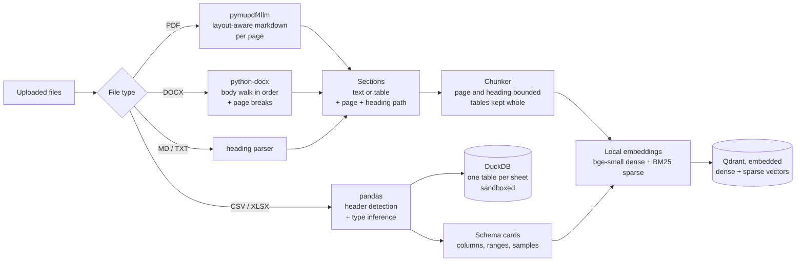
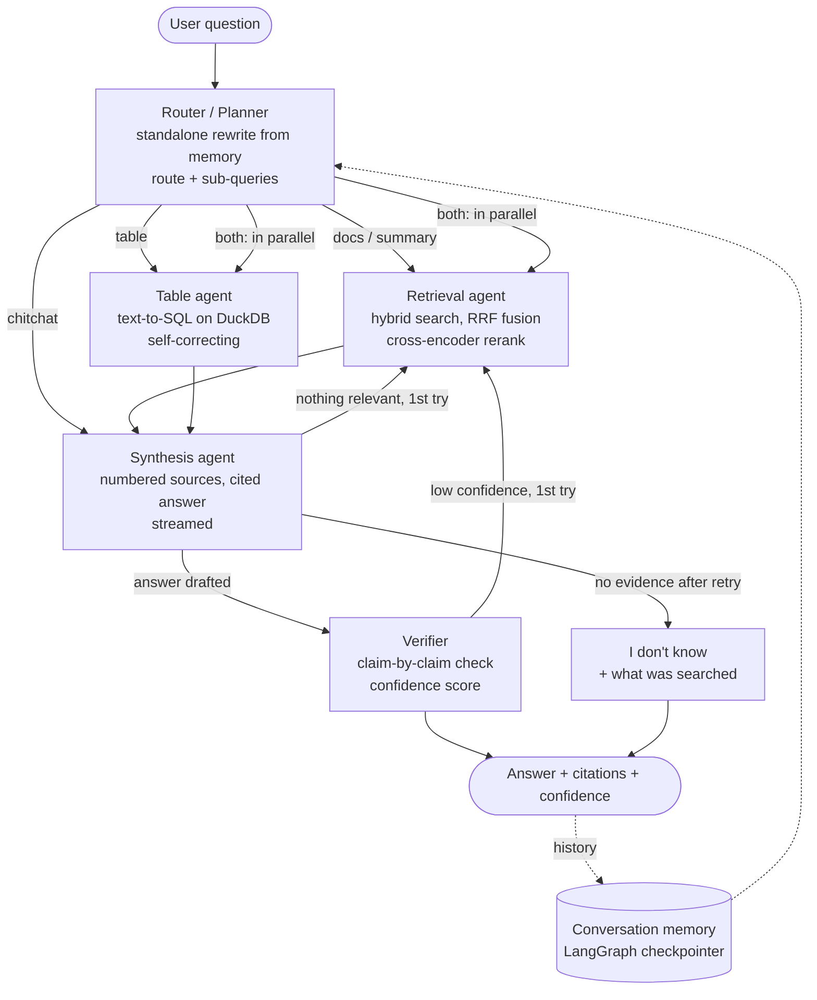

# DocuPilot

DocuPilot is a multi-agent chat app for your files. Upload PDFs, Word documents, Markdown, text files and spreadsheets, then ask questions across all of them. Answers use retrieved passages, include file and page citations, and pass through a verification step. Spreadsheet questions can be computed with real SQL. Model mistakes remain possible; see the measured results and limitations below.

> **Local inference:** Qwen2.5 7B through Ollama, with no API keys. On the existing evaluation, the local model answered **23/27** answerable questions correctly with **24.4 s** median total latency on an M1 Mac with 16 GB RAM. See [Evaluation](#evaluation) for limitations and the historical Gemini baseline.

| | What you get |
|---|---|
| **Citations** | Each claim links to its file, **page number and section path** (e.g. `report.pdf, p. 3, 3 Products > 3.1 Atlas Arm`). Click a `[n]` marker to see the exact passage; PDF sources open at the cited page. |
| **Spreadsheets** | CSV and XLSX files become SQL tables. Totals, rankings and filters are **computed**, and the SQL is shown as the source. |
| **Trust** | A verifier checks every claim against its source, removes unsupported ones, and rates confidence. If the answer isn't in your files, it says so. |
| **Privacy** | Parsing, search, reranking and LLM inference run **locally** with the default Ollama configuration. No API key or hosted inference service is required. |

---

## Setup and running

### Prerequisites
- [uv](https://docs.astral.sh/uv/) (it installs Python 3.12 for you if needed)
- [Ollama](https://ollama.com/download) installed and running locally
- Recommended starting hardware: Apple Silicon with 16 GB RAM, or an equivalent machine capable of running a quantized 7B model
- About 4.7 GB of disk for `qwen2.5:7b`, plus runtime memory for the model and its context
- About 200 MB of disk for the local models (embeddings, BM25, reranker), downloaded once on first run

### Install

Open the Ollama application before pulling the model, or run `OLLAMA_NO_CLOUD=1 ollama serve` in a separate terminal. This local-only server setting also disables Ollama cloud features. Do not start a second server if Ollama is already running.

```bash
git clone <this repo> && cd DocuPilot
uv sync                     # creates .venv and installs dependencies
cp .env.example .env        # optional: defaults work without any API keys
ollama pull qwen2.5:7b      # one-time model download
```

### Run the app

```bash
uv run chainlit run app.py          # opens http://localhost:8000
```

1. Attach files with 📎 or by drag and drop. You can add more at any point in the conversation.
2. Ask questions, for example *"What was Q3 operating margin?"*, *"Total revenue by region"*, *"Compare the report's Q4 revenue with the sales sheet"* or *"Summarize the handbook"*.
3. Click any `[n]` to open its source. Expand the agent steps above an answer to see the route, the retrieved passages with scores, the SQL, and the per-claim fact-check.

To try it without your own files, generate the sample corpus. It's a 4-page PDF annual report, a DOCX handbook, an MD FAQ, TXT meeting minutes, an XLSX with a title row above its header, and a CSV:

```bash
uv run python -m eval.corpus eval/corpus
```

### Configuration (`.env`)

| Variable | Default | Purpose |
|---|---|---|
| `OLLAMA_BASE_URL` | `http://localhost:11434` | Ollama server address; inference stays local with this default |
| `OLLAMA_MODEL` | `qwen2.5:7b` | Routing, SQL generation, verification, and default answer synthesis |
| `OLLAMA_STRONG_MODEL` | inherits `OLLAMA_MODEL` | Optional separate model for answer synthesis |
| `OLLAMA_NUM_CTX` | `16384` | Context window in tokens; larger windows require more memory |
| `OLLAMA_TIMEOUT_S` | `300` | Request/read timeout in seconds; connection timeout is 5 seconds |
| `RERANK_MODEL` | `Xenova/ms-marco-MiniLM-L-12-v2` | Local cross-encoder (`BAAI/bge-reranker-base` is also supported, but slower) |
| `TOP_K` / `PREFETCH_K` | `8` / `40` | Passages given to the LLM / candidates fetched per search mode |
| `RELEVANCE_THRESHOLD` | `0.08` | Reranker score below which a passage counts as irrelevant |
| `CONFIDENCE_THRESHOLD` | `0.5` | Below this, the verifier triggers one wider retry |
| `MAX_FILES` / `MAX_FILE_MB` | `25` / `200` | Upload limits |
| `USE_OCR` | `false` | OCR for PDF pages without a text layer (Tesseract) |
| `DATA_DIR` | `data` | Local models, vector index and uploads |

No `.env` file is required. Existing `GEMINI_*` and `STRONG_THINKING_BUDGET` settings are ignored and can be removed. Keep unrelated `.env` settings when upgrading.

To change models, pull a local chat/instruct model and set `OLLAMA_MODEL` to its exact tag, for example `llama3.2:3b`, `mistral:7b`, or `phi3:mini`. Leave `OLLAMA_STRONG_MODEL` unset to use that same model everywhere. Alternative models need their own quality checks. Use local model tags; the application has no cloud fallback or API-key configuration.

### Tests and evaluation

```bash
uv run pytest                                 # offline after model caching; no API key or Ollama server needed
uv run python -m eval.run_eval --retrieval-only # retrieval metrics, offline
uv run python -m eval.run_eval                  # local Ollama pipeline; writes eval/results.json
uv run python -m eval.run_eval --only table,u01 # a subset, by question type or id
```

The test suite covers the parsers, chunker, SQL engine and sandbox, and hybrid retrieval, and runs the **full agent graph** with a scripted fake LLM. It checks routing, SQL self-correction, parallel agents, the "I don't know" gate, low-confidence retries and conversation memory. The Ollama wrapper is tested against mock HTTP responses for structured output, configuration, transient errors, cancellation and interrupted streams.

Evaluation output includes the configured model names, context size, client version, platform, accuracy, citations, and latency. Run the full evaluation before comparing models; the smaller local model may not reproduce the historical Gemini results.

### Troubleshooting
- **`Too many packets in payload`**: the UI is configured to use WebSocket directly, avoiding Engine.IO's HTTP polling batch limit. After updating `.chainlit/config.toml`, restart Chainlit and hard-refresh the browser (Cmd+Shift+R on macOS) so existing tabs load the new transport setting.
- **Missing `en-GB` translation**: harmless; Chainlit uses the bundled `en-US` translation and `chainlit.md` instead.
- **Chainlit rejects `DEBUG=release`**: an existing `DEBUG` environment variable can conflict with Chainlit's boolean debug option. Launch with `env -u DEBUG uv run chainlit run app.py`.
- **Cannot connect to Ollama**: open the Ollama application or run `ollama serve`; check `OLLAMA_BASE_URL` and `ollama list`.
- **Model not found**: run `ollama pull qwen2.5:7b`, or pull the exact model configured in `OLLAMA_MODEL` / `OLLAMA_STRONG_MODEL`. The application does not download models automatically.
- **Timeout or memory pressure**: wait for model loading, close other memory-heavy applications, increase `OLLAMA_TIMEOUT_S`, or select a smaller model. Lowering `OLLAMA_NUM_CTX` reduces memory use but can truncate evidence for long questions.
- **Invalid structured output**: DocuPilot retries once with validation feedback, then reports an error. Retry the question or use a model with stronger JSON support.
- **Interrupted answer**: retry the question. Partial streamed answers are never silently replayed.
- **The first question is slow**: the local models load on first use. After that they are cached in `data/models/`.
- **A scanned PDF gives "no extractable text"**: set `USE_OCR=true` (see [limitations](#known-limitations)).

---

## Architecture

### Ingestion



### Answering a question



### Components

| Concern | Implementation |
|---|---|
| Orchestration | LangGraph `StateGraph` with a checkpointer (conversation memory per chat) |
| LLM | Local Qwen2.5 7B through Ollama's async Python client; configurable models for routing/SQL/verification and synthesis. JSON-schema structured output, Pydantic validation, streaming, bounded retries |
| Embeddings | `BAAI/bge-small-en-v1.5` (dense) + `Qdrant/bm25` (sparse), ONNX via fastembed, local |
| Reranker | `Xenova/ms-marco-MiniLM-L-12-v2` cross-encoder, local |
| Vector DB | Qdrant in embedded mode (no server), named dense and sparse vectors, RRF fusion |
| Parsing | `pymupdf4llm` (PDF), `python-docx` (DOCX), a custom Markdown/TXT parser |
| Tables | pandas + DuckDB (in-memory per chat, external access disabled) |
| UI | Chainlit (file upload, streaming, per-agent steps, citation side panels, PDF viewer) |

### The agents

| Agent | Model | Responsibility |
|---|---|---|
| **Router / Planner** | fast, JSON | Rewrites follow-ups into a standalone question (*"and its warranty?"* becomes *"What is Scout's warranty?"*). Picks a route: `docs`, `table`, `both`, `summary` or `chitchat`. Writes 1–4 search sub-queries and names the files likely to matter. Downgrades routes that can't run with the files loaded. |
| **Retrieval** | local | Hybrid search, then rerank, with a quota per sub-query. Guarantees each file the router named is represented. For `summary` it samples passages evenly across whole files instead. A retry doubles k and adds the user's original wording as a query. |
| **Table / Data** | fast, JSON | Generates 1–3 DuckDB queries from the tables' schema cards and runs them in the sandbox. SQL errors go back to the model for a fix, up to 2 times. The results become citable sources. |
| **Synthesis** | strong, streamed | Answers only from numbered sources, with `[n]` after every factual sentence. Gives both figures when a document and a spreadsheet disagree. If no source is relevant, it skips the LLM call entirely. |
| **Verifier** | fast, JSON | Splits the answer into atomic claims and judges each against its cited source (supported / partial / unsupported). Removes unsupported claims, computes a confidence score, and triggers one retry when confidence is low. |

---

## Key design decisions and trade-offs

### Retrieval and grounding

**1. Chunks never cross a page or heading boundary.**
*Why:* a citation then points to exactly one page and section, which is what makes "p. 3, 3 Products > 3.1 Atlas Arm" possible and precise.
*Trade-off:* short sections produce small chunks with less surrounding context. We offset this by prefixing each chunk's embedding text with `[file › heading path]`.

**2. Hybrid search (dense + BM25) with RRF, then a cross-encoder reranker.**
*Why:* dense vectors capture paraphrase, while BM25 catches rare exact tokens such as supplier names, SKUs and codes that embeddings blur. The reranker then produces a calibrated relevance score, which the "I don't know" gate depends on.
*Trade-off:* reranking costs about 0.3 s per query on CPU and adds a model to ship.

**3. Tables are linearized before embedding and reranking.**
*Why:* cross-encoders are trained on prose and score raw markdown tables terribly. A perfectly relevant quarterly-results table scored 0.05. Rewriting each row as `Quarter: Q3; Revenue ($M): 104.7; Operating margin: 13.1%` raised that to 0.99. Users still see the markdown.
*Trade-off:* the embedded text differs from the displayed text, which adds a little complexity.

**4. A small, fast reranker, measured rather than assumed.**

| Reranker | Latency per query | Relevant vs. off-topic score |
|---|---|---|
| `bge-reranker-base` | 2.9 s | 0.74–1.0 vs ≤ 0.003 |
| `jina-v1-turbo` | 0.6 s | 0.38–0.87 vs ≤ 0.04 |
| **`ms-marco-MiniLM-L-12`** (default) | 1.0 s, 0.29 s after length-sorting | ≥ 0.99 vs 0.0 |

All three got the top result right on every query. MiniLM separates relevant from irrelevant most sharply, which makes the relevance threshold robust.
*Trade-off:* it's trained on English web search, so non-English documents will rank worse (see [limitations](#known-limitations)).

We also sort candidates by length and rerank in batches of 4. Batches are padded to their longest member, so one long chunk slowed every short one; this cut median retrieval latency from 967 ms to 287 ms.

**5. The router's file guesses are a hint, not a filter.**
*Why:* the first version filtered search to the files the router named. On *"When will the Austin facility open, and is it in the annual report?"* it named only the report, and the board minutes holding the answer were never searched. Now the named files are guaranteed to appear, and all files are searched.
*Trade-off:* the context can include slightly more off-target passages.

**6. Keep the top 4 passages once a question is answerable.**
*Why:* the reranker scores each passage against the *whole* question. For multi-hop questions (*"What supplier risk does the report describe, and who was assigned to address it?"*) the passage naming the person scored 0.0 and was dropped. Now, once any passage clears the threshold, the top 4 are kept regardless.
*Trade-off:* more noise reaches the LLM. The verifier is the safeguard.

### Spreadsheets

**7. Spreadsheets are SQL tables, not text.**
*Why:* LLMs can't reliably sum 120 rows from a text dump. DuckDB computes exact answers, and the SQL itself is shown to the user as the source. The loader handles real-world mess: it detects title rows above the header, drops blank rows and columns, and converts `"$1,200"` to a number, `yes`/`no` to booleans and date strings to dates.
*Trade-off:* text-to-SQL can misread the question. Each query, its result and any self-corrections are visible in the UI so users can check them.

**8. Defence-in-depth SQL sandbox.**
*Why:* the model generates code that we execute. A validation step allows only a single `SELECT`/`WITH` statement, and a row limit and timeout apply. The real boundary is DuckDB's `enable_external_access = false`, which blocks reading files or URLs even if the checks are bypassed and can't be re-enabled at runtime.
*Trade-off:* the validation is intentionally conservative. A column literally named `set` or `load` would be rejected.

### Trust

**9. Separate verification pass with claim-level checks.**
*Why:* self-consistency at generation time isn't enough. A second, structured pass lists each claim with its citation and verdict, which gives a confidence score, lets us remove unsupported claims, and shows its reasoning in the UI.
*Trade-offs:*
- It adds a model call after the answer finishes streaming. The answer appears immediately and the confidence badge follows; verification time depends on the local model and answer length.
- The verifier is from the same model family as the writer, so they can share blind spots.

**10. "I don't know" is enforced in code, not just in the prompt.**
*Why:* if no passage clears the relevance threshold, synthesis is skipped entirely, since an LLM with no evidence is exactly when it hallucinates. The search is widened once, and then the user gets a clear "I couldn't find that in your files", along with what was searched and the closest near-misses.
*Trade-off:* a question phrased very differently from the source text or routed incorrectly could be refused. Hybrid search and the widened retry help, but the local evaluation had 3/27 false refusals.

### Model and deployment choices

**11. One local model by default, with separate roles available.**
*Why:* Qwen2.5 7B handles routing, SQL, verification and synthesis without loading two models into memory. The existing fast/strong interfaces remain, and `OLLAMA_STRONG_MODEL` can select a different synthesis model.
*Trade-off:* the default model has measured routing errors. Median time to first token was 13.12 s on the M1 Mac; other model choices need their own quality and latency checks.

**12. Local embeddings and local LLM inference.**
*Why:* your whole corpus is indexed on-device. After the first model download, loading makes zero network calls, verified by logging outgoing HTTP. Only the handful of passages relevant to each question reach the local Ollama model.
*Trade-off:* dependencies and models must be downloaded initially, and Ollama must remain running. Subsequent inference uses local hardware with no API key.

**13. Embedded, per-session storage.**
*Why:* Qdrant runs embedded, and DuckDB and conversation memory live in memory per chat. No separate database service is needed; Ollama runs alongside the app for inference.
*Trade-off:* sessions don't survive a restart, and a single process owns the index (see [limitations](#known-limitations)).

**14. Parsing choices.**
*Why:* `pymupdf4llm` is fast (about 70 ms per page), keeps tables and heading levels, and runs locally. We preferred it to heavier ML parsers (Docling, Marker) to keep ingestion interactive.
*Trade-off:* complex layouts such as multi-column scientific papers, rotated tables or forms may parse less cleanly than with ML-based layout models.

---

## Evaluation

`eval/questions.jsonl` has 31 questions over the sample corpus:
- 16 single-document facts with an expected file and page
- 3 cross-document questions
- 6 spreadsheet calculations, with ground truth computed independently by pandas
- 2 multi-turn follow-ups
- 4 unanswerable questions

### Local Ollama results

Measured on 2026-09-26 with `qwen2.5:7b` (Q4_K_M), Ollama 0.32.5, a 16,384-token context, and a Mac mini with Apple M1 / 16 GB RAM. All 31 questions completed without API keys or runtime errors.

| Metric | Local result |
|---|---|
| Answer accuracy (answerable) | **23/27 (85.2%)** |
| Citation accuracy (expected file/page) | **23/27 (85.2%)** |
| Single-document / cross-document / spreadsheet / follow-up accuracy | 13/16 · 3/3 · 5/6 · 2/2 |
| Automated refusal score on unanswerable questions | **3/4** |
| False refusal on answerable questions | 3/27 |
| Median time to first token / total, including verification | **13.12 s / 24.4 s** |

Four answerable questions were routed incorrectly, including a customer-count question that produced an incorrect number through document lookup instead of SQL. The fourth unanswerable response safely redirected the question back to the files, but its wording did not match the evaluator's refusal regex. A separate short summary request passed with citations to all four report pages; a more detailed summary request incorrectly chose document lookup. These results do not match the historical Gemini baseline. See the [local evaluation report](eval/ollama-evaluation.md) for environment details, failed questions, and additional checks.

### Historical Gemini baseline

These measurements were recorded before the Ollama migration, using Gemini. They are not results for the current local defaults:

| Metric | Result |
|---|---|
| Answer accuracy (answerable) | **27/27 (100%)** |
| · single-document facts | 16/16 |
| · cross-document | 3/3 |
| · spreadsheet calculations | 6/6 |
| · multi-turn follow-ups | 2/2 |
| Citation accuracy (right file and page cited) | **27/27 (100%)** |
| Retrieval hit@8 | **21/21 (100%)** |
| "I don't know" on unanswerable | **4/4 (100%)** |
| False "I don't know" on answerable | **0/27** |
| Median time to first token / total (incl. verification) | 5.1 s / 7.3 s |

Retrieval alone (offline): top-1 correct file and page on 19/19 questions, with a median of 287 ms.

The first version scored 24/27, with 3/4 "I don't know" on unanswerable questions. Every miss was a cross-document question, and each one led to a design change (decisions 5 and 6 and the source-reconciliation prompt rule). **Caveat:** 31 questions over a synthetic corpus is a regression suite, not a benchmark. It proves each mechanism works and catches regressions, but it isn't evidence of accuracy on arbitrary real-world documents.

---

## Known limitations

**Formats and parsing**
- **MVP formats only.** PDF, DOCX, MD, TXT, CSV/TSV and XLSX are supported. Images, PPTX, code files, audio and HTML are not yet.
- **Scanned PDFs.** Pages without a text layer produce no text unless `USE_OCR=true`, and that OCR path (Tesseract via pymupdf4llm) is not covered by tests. Charts and figures are not interpreted.
- **DOCX page numbers are approximate** (shown as `p. ~N`) unless Word saved rendered page breaks. DOCX has no fixed pages, since pagination depends on the renderer.
- **Complex spreadsheets.**
  - Multi-row or merged headers and several tables stacked on one sheet aren't detected; each sheet is one table with one header row.
  - Formula cells use their cached values, so files generated by tools that don't store computed values will show empties.

**Answer quality**
- **English-centric retrieval.** Both the embedding model and the reranker are English-trained, so other languages will retrieve noticeably worse.
- **Summaries of long documents are shallow.** The summary route samples 16 passages evenly, which is fine for reports but misses detail in a 300-page document, because there is no map-reduce summarization.
- **Confidence is not calibrated.** It's a heuristic (claim support plus retrieval relevance), not a probability of correctness. In the local evaluation, an incorrect customer count received a confidence score of 0.73.
- **Verifier bias.** The verifier and the writer are the same model family, so a claim both misread the same way will pass.
- **Prompt injection.** Document text goes into prompts. A malicious document could try to steer answers. The SQL sandbox protects data access, but the answer text itself isn't protected.

**Deployment**
- **Ephemeral, single-process sessions.** Uploads, tables and memory are cleared on restart. There are no user accounts or persistence, and embedded Qdrant can't be shared by several app processes.
- **Scale.** Embedded Qdrant keeps vectors in memory. It's comfortable at tens of thousands of chunks per instance; bigger corpora need Qdrant server mode. Files are ingested one after another.
- **Initial downloads required.** Install dependencies and download the Ollama, embedding and reranker models before working offline. Subsequent inference requires the local Ollama service, with no API key. Local speed and answer quality depend on hardware and model size.

## Future work

**Near term**
- **Vision and OCR agent.** A local multimodal model for images, charts and scanned pages, alongside Tesseract or PaddleOCR.
- **More formats.** PPTX via `python-pptx` with slide-number citations, code files with language-aware chunking, HTML via trafilatura, and audio/video transcripts via faster-whisper.
- **Highlight the cited span** inside the PDF viewer, using PyMuPDF text positions.
- **Map-reduce summaries** for long documents.

**Quality**
- **A bigger, real-world eval.** Public document-QA sets (financial reports, DocVQA-style scans), plus human-labelled citation checks.
- **Calibrate confidence** on that eval so the score means an actual probability of being correct.
- **An independent verifier model**, from a different family, to reduce shared blind spots.
- **Multi-row header and multi-table sheet detection** for spreadsheets.
- **Multilingual retrieval**, e.g. `bge-m3` and `jina-reranker-v2-base-multilingual`, which fastembed already supports.

**Deployment**
- **Persistence and multi-user support.** Qdrant server, DuckDB on disk, a persistent checkpointer, and authentication (all supported by Chainlit).
- **Lower latency** by running retrieval speculatively in parallel with the router.

---

## Project layout

```
app.py               Chainlit UI: uploads, streaming, agent steps, citations, PDF viewer
docupilot/
  config.py          settings (.env)
  llm.py             Local Ollama wrapper: JSON-schema output, validation, streaming, retries
  models.py          Section / Chunk / Citation / TableInfo …
  workspace.py       per-session files: parse → chunk → index; DuckDB tables
  retrieval.py       hybrid search + rerank + sub-query quotas + file guarantees
  prompts.py         all agent prompts
  agents/            router, retriever, table, synthesis, verifier, graph (LangGraph wiring)
  ingest/            pdf.py, word.py, text.py, tabular.py, chunker.py
  index/             embed.py (local models), store.py (Qdrant)
eval/
  corpus.py          deterministic multi-format corpus with known answers
  questions.jsonl    31 eval questions
  run_eval.py        eval harness (retrieval-only or full pipeline)
tests/               pytest suite (offline)
```
